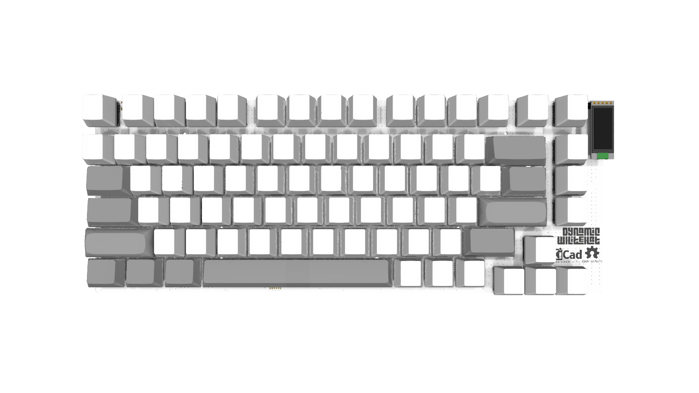
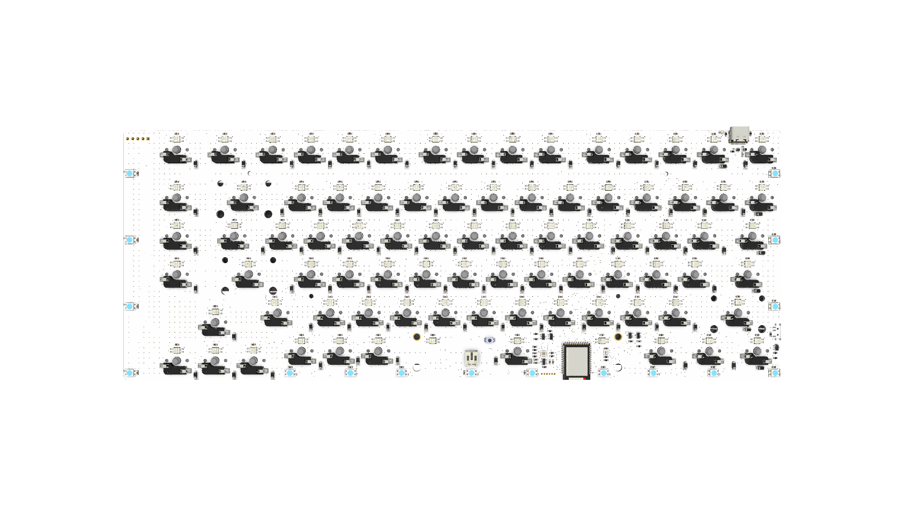
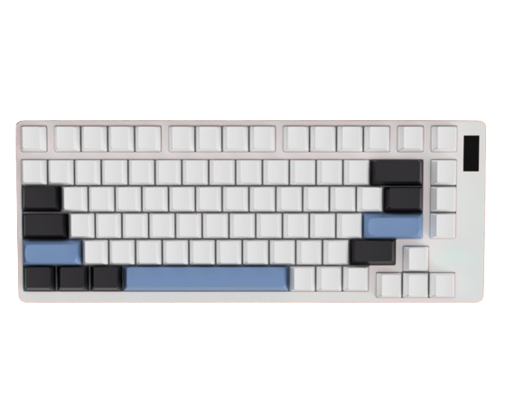
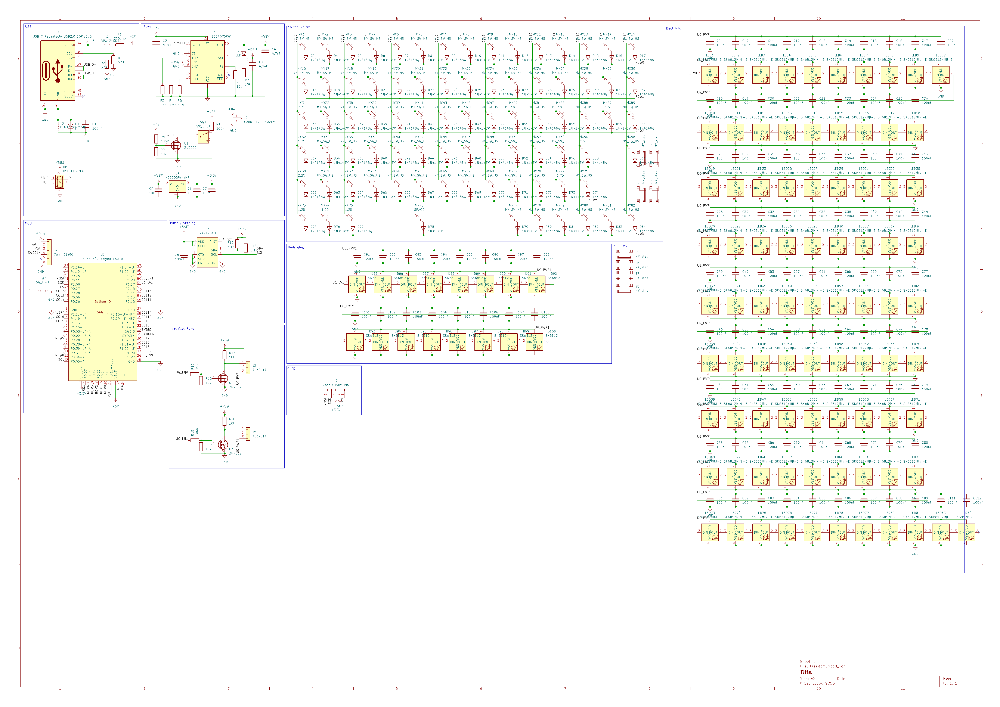
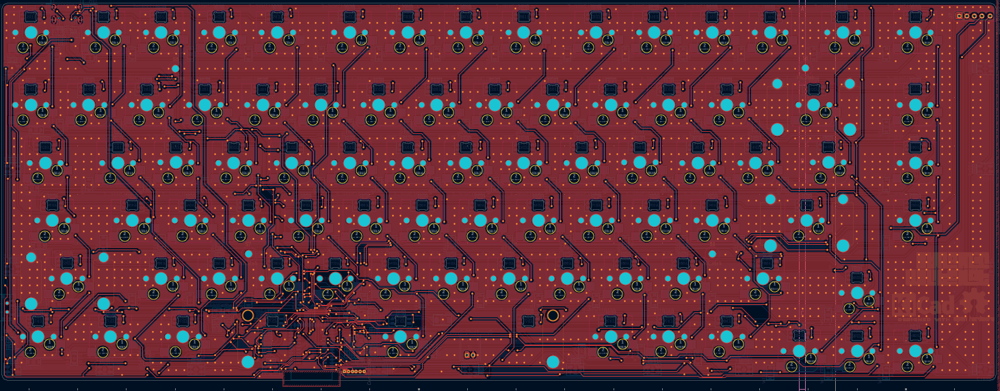
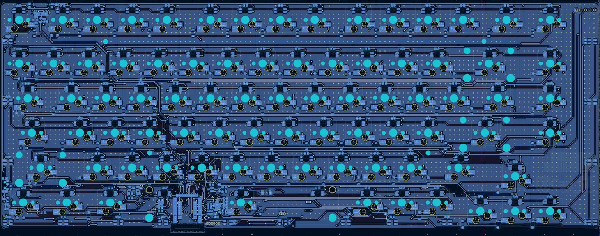
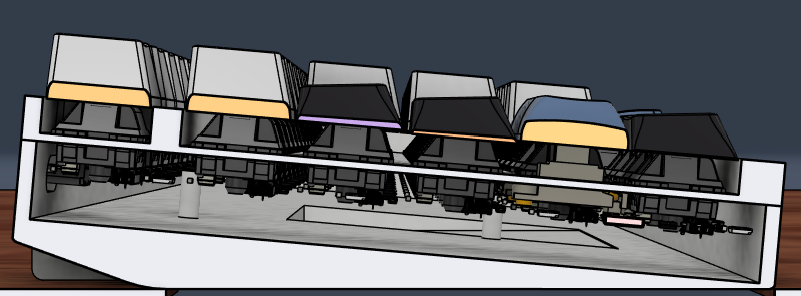

# Arc
A Wireless 75% Backlit Keyboard

> [!NOTE]
> Firmware available [here](https://github.com/DynamicWhiteHat/ArcFirmware)

## Features:
- HolyIOT 18010 MCU
- RGB backlight and underglow
- Nice!View e-paper display
- Wireless ZMK firmware

## Image Gallery:
<table align="center">
  <tr>
    <td align="center">
      
    </td>
    <td align="center">
      
    </td>
  </tr>
  <tr>
    <td align="center" colspan="2">
      
    </td>
  </tr>
</table>

## Why I Designed This Project:

After designing Corneucopia, I decided that I wanted to create a regular keyboard. I have attempted to make many in the past, but
I never got around to finishing them. Now that I had experience making a wireless split, I decided to make a wireless regular. This was also a test of making a PCB with just the MCU. Previously, I have made PCBs with the ESP32 SoM, but this was my first chip PCB that didn't use the ESP32.

## Schematics And PCBS:
<table align="center">
  <tr>
    <td align="center" colspan="2">
      
    </td>
  </tr>
  <tr>
     <td align="center">
      
    </td>
    <td align="center">
      
    </td>
  </tr>
</table>

## Mounting:
The project features a design that keeps all screws hidden on the inside of the case, keeping a seamless look on the outside. This design has already been applied in [Corneucopia](https://github.com/DynamicWhiteHat/Corneucopia/). The PCB is screwed into the bottom case using 4 M2 screws. The top case is held in place by the hot-swappable switches.

## Technical Details:
Powered by a HolyIOT 18010, running ZMK firmware, this board supports a wireless bluetooth connection. It uses the SK6812 mini-e for per-key RGB, and regular the sk6812 mini for underglow. 

## BOM:
| Part                        | Quantity        | Price              | Link                                                                                     |                 |                |          |                                                   |
|-----------------------------|-----------------|--------------------|------------------------------------------------------------------------------------------|-----------------|----------------|----------|---------------------------------------------------|
| Nice!View                   | 1               | -                  | Already Owned                                                                            |                 |                |          |                                                   |
| PCB                         | 1 Order         | $33.02             | JLCPCB Quote                                                                             |                 |                |          |                                                   |
| PCB Parts                   | 1 Order         | $32.22             | See LCSC BOM                                                                             |                 |                |          |                                                   |
| Switches                    | 1 Pack Of 90    | $22.80             | https://www.amazon.com/KPREPUBLIC-Outemu-Mechanical-Keyboard-Tactile/dp/B0BZ48GW7K/      |                 |                |          |                                                   |
| Hotswaps                    | 1 Pack Of 100   | $8.80              | https://www.aliexpress.us/item/2251832764937566.html                                     |                 |                |          |                                                   |
| Stabilizers                 | 1 Pack          | $18.99             | https://www.amazon.com/DUROCK-Stabilizers-Translucent-Keyboard-Mechanical/dp/B0B2RR8YB3/ |                 |                |          |                                                   |
| HolyIOT 18010 MCU           | 1               | $13.53             | https://www.aliexpress.us/item/3256804605353119.html                                     |                 |                |          |                                                   |
| Keycaps                     | 1               | $25.44             | https://www.aliexpress.us/item/3256807060329248.html                                     |                 |                |          |                                                   |
| Plastic Sheet For Stencil   | 1               | $12.99             | https://www.amazon.com/dp/B09Q14HNVD                                                     |                 |                |          |                                                   |
| Lipo Battery                | 1               | $10.49             | https://www.amazon.com/Qimoo-Battery-Rechargeable-Connector-Electronic/dp/B0CNLNKSKK/    |                 |                |          |                                                   |
|                             |                 | $178.28            |                                                                                          |                 |                |          |                                                   |
| LCSC                        |                 |                    |                                                                                          |                 |                |          |                                                   |
| Description                 | Quantity Needed | Mrf#               | Minimum Order Qty.                                                                       | Unit Price(USD) | Ext.Price(USD) | LCSC#    | Product Link                                      |
| 1.5k                        | 1               | 0603WAF1501T5E     | 100                                                                                      | 0.0012          | 0.12           | C22843   | https://www.lcsc.com/product-detail/C22843.html   |
| 100R                        | 3               | 0603WAF1000T5E     | 100                                                                                      | 0.0012          | 0.12           | C22775   | https://www.lcsc.com/product-detail/C22775.html   |
| 100k                        | 1               | 0603WAF1003T5E     | 100                                                                                      | 0.0011          | 0.11           | C25803   | https://www.lcsc.com/product-detail/C25803.html   |
| 100nF                       | 103             | CC0603KRX7R9BB104  | 200                                                                                      | 0.0021          | 0.42           | C14663   | https://www.lcsc.com/product-detail/C14663.html   |
| 10k                         | 7               | 0603WAF1002T5E     | 100                                                                                      | 0.0012          | 0.12           | C25804   | https://www.lcsc.com/product-detail/C25804.html   |
| 1N4148W                     | 82              | 1N4148W            | 100                                                                                      | 0.011           | 1.1            | C81598   | https://www.lcsc.com/product-detail/C81598.html   |
| 1uF                         | 2               | CL10A105KB8NNNC    | 50                                                                                       | 0.0056          | 0.28           | C15849   | https://www.lcsc.com/product-detail/C15849.html   |
| 2N7002                      | 3               | 2N7002             | 50                                                                                       | 0.0137          | 0.69           | C8545    | https://www.lcsc.com/product-detail/C8545.html    |
| 3.9k                        | 1               | 0603WAF3901T5E     | 100                                                                                      | 0.0014          | 0.14           | C23018   | https://www.lcsc.com/product-detail/C23018.html   |
| 4.7uF                       | 3               | CL10A475KO8NNNC    | 10                                                                                       | 0.0103          | 0.1            | C19666   | https://www.lcsc.com/product-detail/C19666.html   |
| 47k                         | 1               | 0603WAF4702T5E     | 100                                                                                      | 0.0012          | 0.12           | C25819   | https://www.lcsc.com/product-detail/C25819.html   |
| 5.1K                        | 1               | 0603WAF5101T5E     | 100                                                                                      | 0.0012          | 0.12           | C23186   | https://www.lcsc.com/product-detail/C23186.html   |
| 5.1k                        | 3               | 0603WAF5101T5E     | 100                                                                                      | 0.0012          | 0.12           | C23186   | https://www.lcsc.com/product-detail/C23186.html   |
| 750 mA                      | 1               | BSMD0603-075-6V    | 10                                                                                       | 0.0656          | 0.66           | C914092  | https://www.lcsc.com/product-detail/C914092.html  |
| A03401A                     | 2               | AO3401A            | 10                                                                                       | 0.0583          | 0.58           | C15127   | https://www.lcsc.com/product-detail/C15127.html   |
| BLM15PX121SN1D              | 2               | BLM15PX121SN1D     | 100                                                                                      | 0.0059          | 0.59           | C88970   | https://www.lcsc.com/product-detail/C88970.html   |
| BQ24075RGT                  | 1               | BQ24075RGTT        | 1                                                                                        | 1.4633          | 1.46           | C2865459 | https://www.lcsc.com/product-detail/C2865459.html |
| Conn_01x02_Socket           | 1               | S2B-PH-K-S(LF)(SN) | 20                                                                                       | 0.0372          | 0.74           | C173752  | https://www.lcsc.com/product-detail/C173752.html  |
| D                           | 1               | BSD3C051V          | 10                                                                                       | 0.069           | 0.69           | C151996  | https://www.lcsc.com/product-detail/C151996.html  |
| LED                         | 1               | KT-0603W           | 50                                                                                       | 0.0118          | 0.59           | C2290    | https://www.lcsc.com/product-detail/C2290.html    |
| MAX17048                    | 1               | MAX17048G+T10      | 1                                                                                        | 2.6708          | 2.67           | C2682616 | https://www.lcsc.com/product-detail/C2682616.html |
| SK6812                      | 16              | SK6812SMINI        | 20                                                                                       | 0.0618          | 1.24           | C7423118 | https://www.lcsc.com/product-detail/C7423118.html |
| SK6812MINI-E                | 84              | SK6812MINI-E       | 85                                                                                       | 0.0742          | 6.31           | C5149201 | https://www.lcsc.com/product-detail/C5149201.html |
| SW_Push                     | 1               | TS-1088-AR02016    | 10                                                                                       | 0.0455          | 0.46           | C720477  | https://www.lcsc.com/product-detail/C720477.html  |
| SW_SPDT                     | 1               | SSSS811101         | 5                                                                                        | 0.1439          | 0.72           | C109335  | https://www.lcsc.com/product-detail/C109335.html  |
| USBLC6-2P6                  | 1               | USBLC6-2P6-MS      | 5                                                                                        | 0.1024          | 0.51           | C3647099 | https://www.lcsc.com/product-detail/C3647099.html |
| USB_C_Receptacle_USB2.0_16P | 1               | TYPE-C-31-M-12     | 5                                                                                        | 0.1681          | 0.84           | C165948  | https://www.lcsc.com/product-detail/C165948.html  |
| XC6206PxxxMR                | 1               | XC6206P332MR-G     | 5                                                                                        | 0.11            | 0.55           | C5446    | https://www.lcsc.com/product-detail/C5446.html    |
|                             |                 |                    |                                                                                          | Subtotal:       | $22.35         |          |                                                   |
|                             |                 |                    |                                                                                          | Shipping:       | $9.87          |          |                                                   |
|                             |                 |                    |                                                                                          | Total:          | $32.22         |          |                                                   |
